<div align="center">


# SentinelMesh 

**An open-source, self-hostable AI Security Operations Center.** It ingests your security telemetry, detects and correlates threats, investigates them with AI agents whose reasoning is fully auditable, and proposes responses a human approves.

[](https://opensource.org/licenses/MIT) [](CHANGELOG.md) [](https://github.com/beenuar/AiSOC/actions/workflows/ci.yml)
[](https://github.com/beenuar/AiSOC/actions/workflows/codeql.yml) [](https://securityscorecards.dev/viewer/?uri=github.com/beenuar/AiSOC) [](https://github.com/beenuar/AiSOC/blob/main/apps/web/public/papers/aisoc-technical-guide.pdf)

**[Technical Guide (PDF)](https://github.com/beenuar/AiSOC/blob/main/apps/web/public/papers/aisoc-technical-guide.pdf)** · [Docs](https://beenuar.github.io/AiSOC/) · [Architecture](docs/architecture/README.md) · [What actually works](docs/audit/REPOSITORY_REALITY.md) · [Discussions](https://github.com/beenuar/AiSOC/discussions)

</div>

---

## What AiSOC does

Telemetry arrives from your security tools. AiSOC normalizes it, runs the 2603 executable rules of
its 6991-rule library, groups what fires into incidents, investigates each one with an AI agent whose
every prompt and tool call is recorded, and proposes an action. New threat intelligence re-sweeps the
history you already collected, and a human approves before anything reaches a vendor.

## What it looks like running

<a href="apps/web/public/demo/demo.mp4">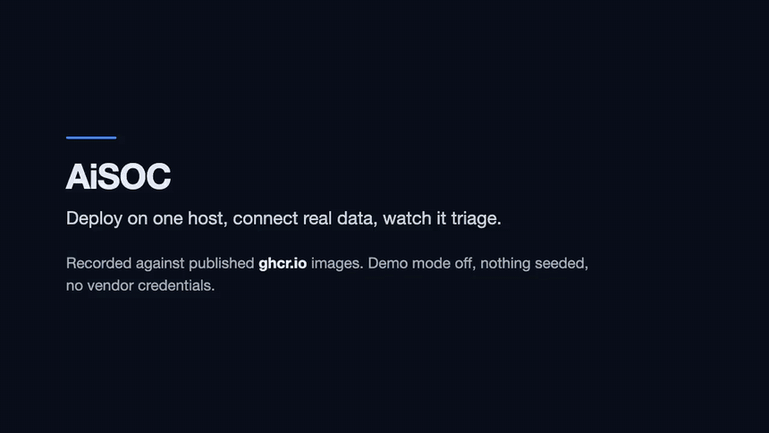</a>

**[Watch the full three minutes](apps/web/public/demo/demo.mp4)** — install to AI verdict on one
server against the published images, terminal waits shortened and the recording saying so on screen.
The stills below are earlier runs under the same rules: no seeded rows, no demo mode, no mockups.
([step by step](apps/docs/docs/deployment/walkthrough.mdx) · [what is real](apps/web/public/screenshots/README.md))

| | |
|---|---|
| 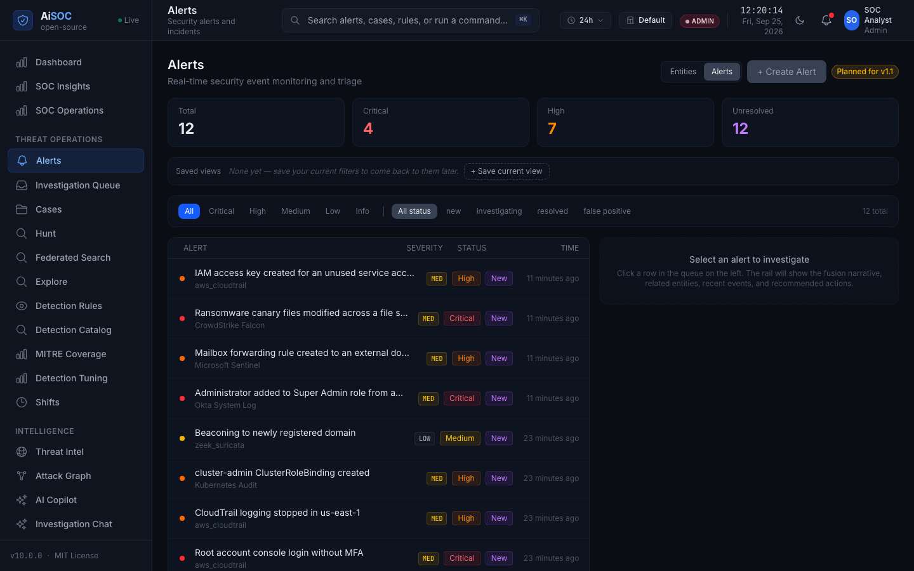 | 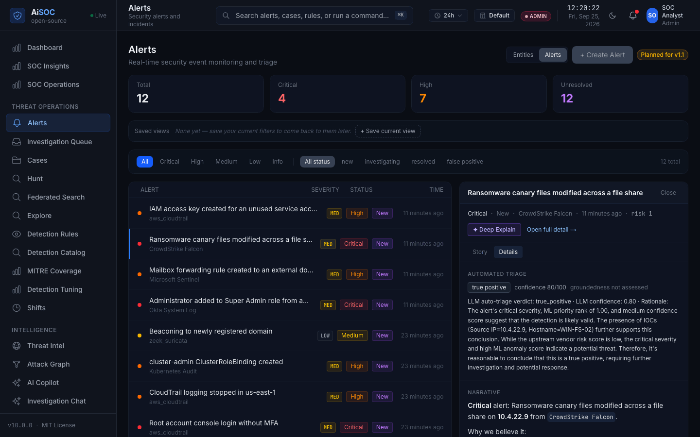 |
| **Alerts** — each attributed to the connector that fed it. | **Automated triage** — the bundled local model's verdict, confidence and rationale, verbatim. |
|  |  |
| **Threat intelligence** — the real CISA KEV catalog, minutes after boot, with no API key. | **SOC operations** — with nothing connected yet, and it says so rather than showing a placeholder. |

## Quick start

```bash
git clone https://github.com/beenuar/AiSOC && cd AiSOC
make up
```


<div align="center">

**Ingest security telemetry · correlate alerts · investigate with auditable AI agents · respond only with human approval**

<p>
  
  
  
  
  
</p>
<p>
  
  
  
  
  
</p>
<p>
  
  
  
  
</p>

[Overview](#-overview) · [Architecture](#-architecture) · [Agents & MCP](#-ai-agents--mcp) · [Reliability](#-reliability--fault-tolerance) · [Quick Start](#-quick-start) · [Testing](#-testing) · [Observability](#-observability) · [Security](#-security-model) · [Credits](#-attribution--upstream)

</div>

---

> [!IMPORTANT]
> **SentinelMesh is a fork of [AiSOC](https://github.com/beenuar/AiSOC) (MIT License) by beenuar and contributors.**
> The upstream platform provides the base pipeline described below. My own work is documented in
> [What I built on top](#-what-i-built-on-top-of-aisoc) so it is always clear what is upstream and what is mine.

---

## 📌 Overview

**SentinelMesh** is a self-hostable security investigation and response platform. Security telemetry
flows in from external tools, is normalized and carried over Kafka, correlated into incidents, and
investigated by **LangGraph agents that call typed tools through MCP** instead of writing raw queries.
Every prompt, tool call, citation and verdict is recorded in an auditable **Investigation Ledger**, and
response actions are **gated by a human approval that survives restarts**.

### Why it exists

| Problem in a typical SOC | How SentinelMesh addresses it |
|---|---|
| Alert fatigue: thousands of low-signal alerts | Correlation groups related alerts into incidents before an agent looks at them |
| "Black-box" AI verdicts nobody can audit | Ledger records prompts, tool calls, citations, verdict and token cost; investigations are replayable |
| LLMs hallucinating indicators | Verdicts citing an indicator absent from the evidence are **demoted to human review** |
| LLMs writing arbitrary SQL | Agents pick **typed tools** and pass structured arguments; they never write SQL |
| Automation taking unsafe actions | Response steps are human-approved; approvals pause durably in PostgreSQL |
| Pipelines losing data on failure | Kafka transport, durable state, retry/recovery paths and dead-letter handling |

---

## ✨ Feature Highlights

- 🔌 **Telemetry ingestion** — authenticated REST/webhook ingestion plus pull-based connectors (Splunk, Microsoft Sentinel, Elastic, CrowdStrike, Okta, AWS, Kubernetes audit and more)
- 🧬 **Normalization** — vendor payloads mapped to a common event shape before entering the stream
- 🌊 **Event-driven spine** — Kafka carries normalized events to detection, correlation and agents
- 🔗 **Detection & correlation** — rule engine plus grouping of related alerts into incidents
- 🤖 **AI investigation agents** — LangGraph workflows with entity context, prior verdicts and typed tools
- 🧰 **MCP server** — typed tools exposed to MCP clients such as Claude, Cursor and Continue
- 📒 **Investigation Ledger** — prompts, tool calls, citations, verdicts and token cost, with replay
- 🛑 **Human-gated response** — durable approvals that survive restarts and expire with a recorded outcome
- 🛡️ **Validation guardrails** — prompt validation before send, evidence grounding checks after
- 📈 **Observability** — OpenTelemetry traces, Prometheus metrics, Grafana dashboards
- 🧪 **Test-first engineering** — unit, integration, E2E and replay-based detection tests

---

## 🏗️ Architecture

### End-to-end flow

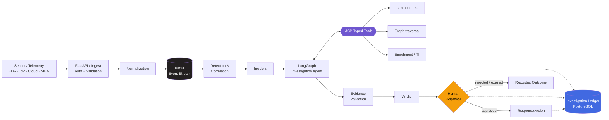

### Component view

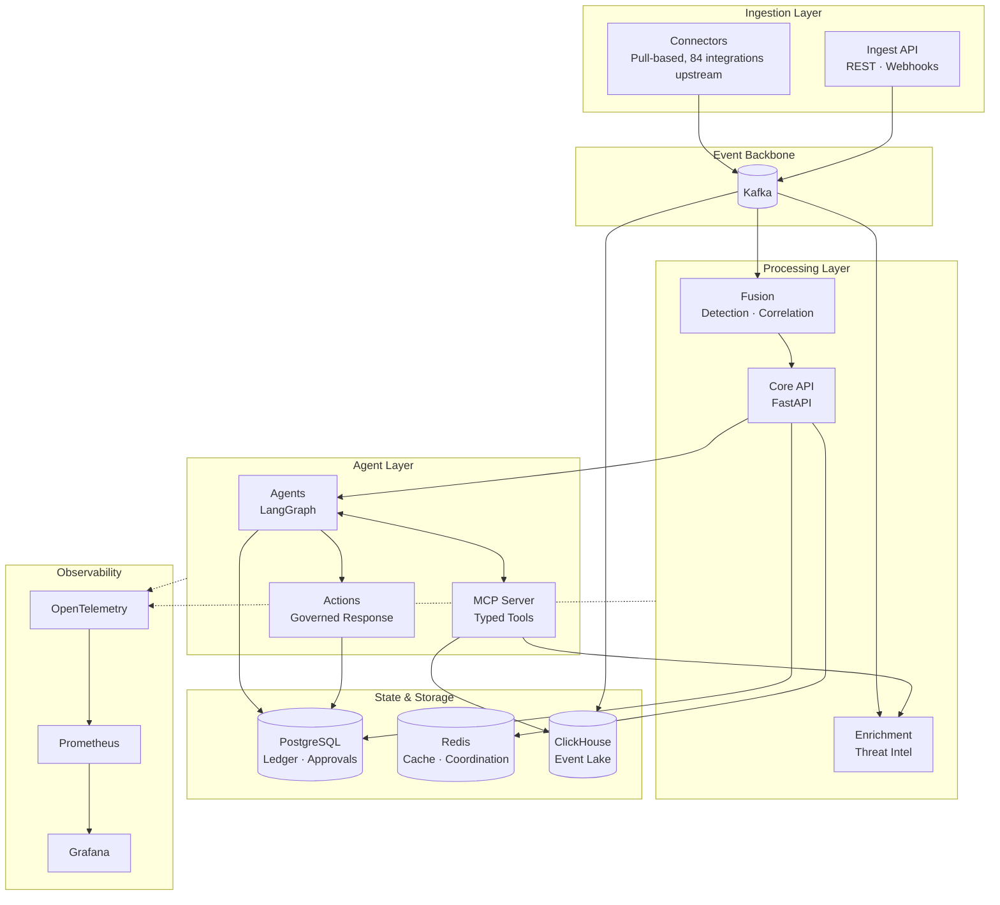

### Tech stack

<div align="center">


</div>

| Layer | Technology | Role |
|---|---|---|
| Backend services | **Python · FastAPI** | REST APIs, agent service, correlation, response services |
| Agent orchestration | **LangGraph** | Stateful, resumable investigation graphs |
| Agent/tool boundary | **MCP** | Typed tool interface for agents and MCP clients |
| Event transport | **Kafka** | Durable, ordered event stream between stages |
| Durable state | **PostgreSQL** | Investigation Ledger, durable approvals, tenant data |
| Cache / coordination | **Redis** | Fast lookups and short-lived coordination state |
| Event lake | **ClickHouse** | Analytical queries and hunting over collected telemetry |
| Packaging | **Docker / Compose** | Reproducible local and production-class deployment |
| Testing | **PyTest** | Unit, integration and replay tests |
| Telemetry | **OpenTelemetry · Prometheus · Grafana** | Traces, metrics and dashboards |

> The upstream ingest service is written in **Go** and the MCP server in **TypeScript**; the agent,
> API, fusion and actions services are **Python/FastAPI**.

---

## 🤖 AI Agents & MCP

### Investigation reasoning path

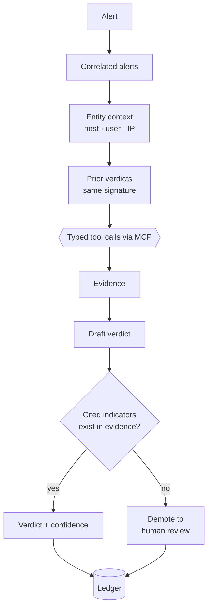

### What agents can and cannot do

| ✅ Agents can | ❌ Agents cannot |
|---|---|
| Read the alert, correlated siblings, entity context and prior verdicts | Write or execute arbitrary SQL |
| Call **typed tools** with structured arguments | Send raw logs, payloads or secret-shaped values to the model (refused at validation) |
| Cite evidence for each checkable claim | Auto-close a verdict that cites a non-existent indicator |
| Propose a response action | Touch a vendor system without human approval (unless a tenant explicitly grants autonomy for that action) |

### MCP tool surface

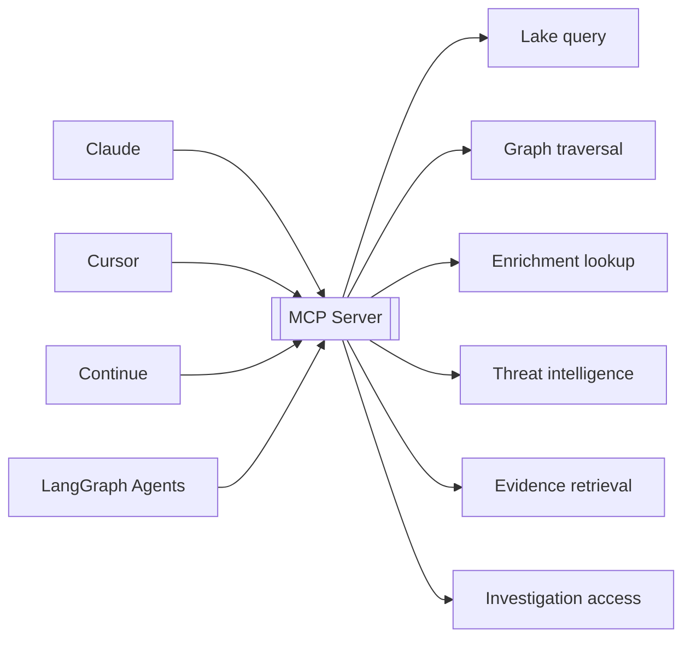

The model chooses a tool and supplies structured arguments; the server owns query construction, so the
tool boundary is also the **security boundary**.

### Investigation Ledger

Each investigation records:

- Prompts (stored as digests in exported bundles)
- Every tool call with arguments and result
- Citations linking claims to evidence
- Verdict, confidence and rationale
- Token cost

This makes an investigation **replayable** and exportable as an evidence bundle.

---

## 🛡️ Reliability & Fault Tolerance

### Durable human approval

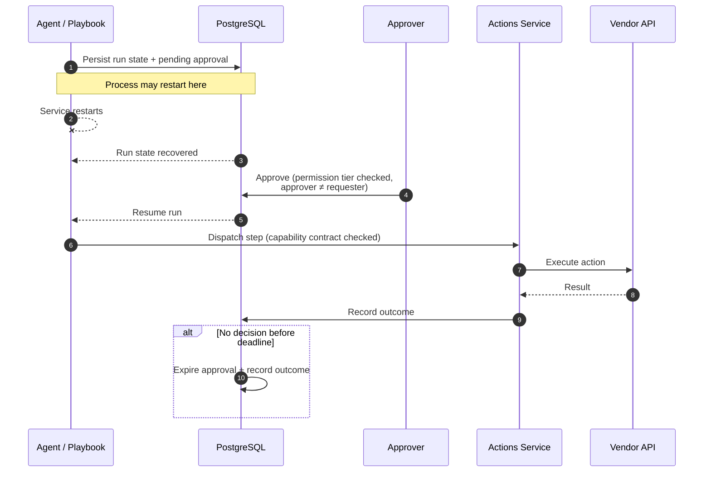

### Failure handling model

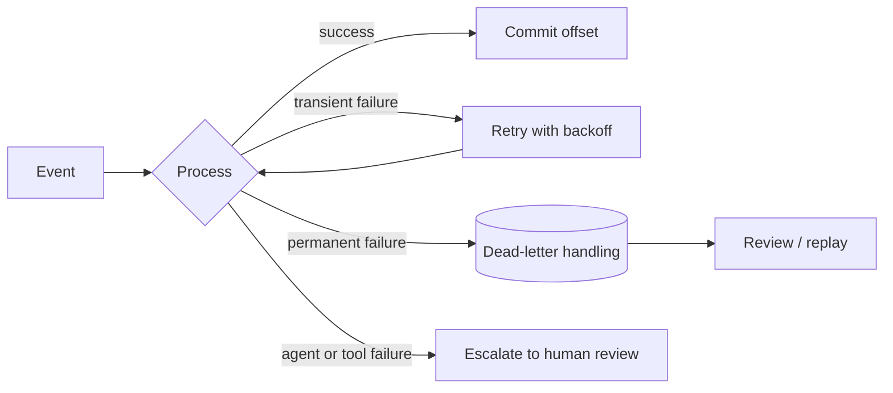

| Failure | Mitigation |
|---|---|
| Service restart mid-investigation | State persisted in PostgreSQL, run resumes |
| Approval never answered | Approval expires with a recorded outcome instead of hanging |
| Tool/agent error | Failure is recorded and routed to human review |
| Hallucinated indicator | Grounding check demotes the verdict |
| Sensitive data in a prompt | Validation refuses it before the model sees it |
| Downstream outage | Kafka retains events until consumers recover |

---

## 🚀 Quick Start

### Requirements

- Docker with Compose v2 (about **8 GB memory** and **20 GB free disk** for the core profile)
- Python 3.9+ and `bash`
- `make`

### Run it

```bash
git clone https://github.com/<your-username>/SentinelMesh
cd SentinelMesh
make doctor   # check host requirements
make up       # start the core stack and print sign-in details
make smoke    # push one real event through the whole pipeline
```

`make smoke` follows one event through ingest, Kafka, detection and Postgres and reports PASS/FAIL per stage.

### Deployment profiles

| Profile | Command | Includes |
|---|---|---|
| **core** | `make up` | Ingest → detect → correlate → alert → triage → console, LLM gateway, local model |
| **full** | `make up-full` | Core plus event lake, entity graph, full-text search, enrichment |
| **demo** | `make up && make demo` | Core plus clearly labelled synthetic data |

### Send telemetry

```bash
curl -X POST http://localhost:8081/v1/ingest/batch \
  -H 'Content-Type: application/json' \
  -H "Authorization: Bearer $INGEST_TOKEN" \
  -d '{"connector_id":"edr-1","connector_type":"crowdstrike",
       "events":[{"severity":"high","title":"Encoded PowerShell from Office","host":"WIN-FIN-01"}]}'
```

---

## 🧪 Testing

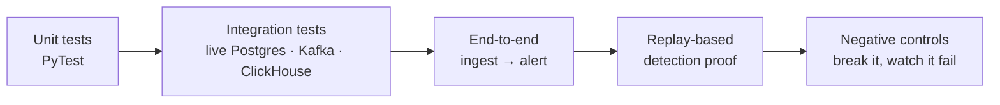

```bash
make test    # unit tests for every service
make smoke   # golden pipeline against a running stack
```

- **Unit and integration tests** for services, run against real infrastructure where it matters
- **Replay-based detection testing** — a rule counts as executable only after a vendor-shaped event is replayed and the rule is observed firing
- **Negative controls** — the check is proven by deliberately breaking the behavior and confirming it fails
- **CI on every pull request**

---

## 📈 Observability

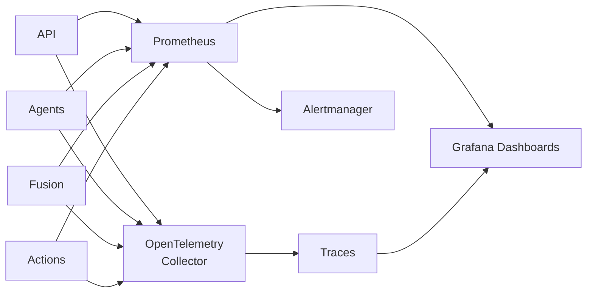

| Signal | Tooling | Used for |
|---|---|---|
| Traces | OpenTelemetry | Following one alert across services and agent steps |
| Metrics | Prometheus | Throughput, latency, failure and retry counts |
| Dashboards | Grafana | Pipeline health, agent/tool failures, token cost |
| Alerting | Alertmanager | Notifying on service or pipeline degradation |

---

## 🔐 Security Model

| Control | Description |
|---|---|
| **RBAC** | Role-gated mutating routes; approver must hold the required tier and cannot be the requester |
| **Tenant isolation** | Enforced at the query layer in every store; row-level security via a DML-only database role |
| **Authenticated ingest** | Tenant derived from the credential, not a client-supplied header |
| **Encrypted credentials** | Connector credentials encrypted at rest; secrets generated per deployment |
| **Least privilege** | Connector scopes kept minimal |
| **Prompt-injection & tool-abuse threat modeling** | Documented threat models for agent/tool interaction |
| **Capability contracts** | Every response step is checked at dispatch; approving a playbook does not authorise arbitrary steps |
| **Fail closed** | A service without a credential refuses to serve rather than serving unauthenticated |

---

## 🧱 Repository Layout

```
SentinelMesh/
├── services/
│   ├── ingest/        # ingestion workers (upstream: Go)
│   ├── fusion/        # detection + correlation (Python)
│   ├── agents/        # LangGraph investigation agents (Python)
│   ├── mcp/           # MCP server with typed tools (TypeScript)
│   ├── actions/       # governed response actions (Python)
│   ├── api/           # core REST API (FastAPI)
│   ├── enrichment/    # enrichment + threat intel
│   └── connectors/    # vendor connectors
├── apps/web/          # operator console (Next.js)
├── detections/        # detection rules
├── playbooks/         # response playbooks
├── packages/          # SDKs and shared packages
├── infra/             # deployment config
├── docs/              # architecture, security, runbooks
├── docker-compose.yml
└── Makefile
```

---

## 🛠️ What I Built on Top of AiSOC

> **Fill this section in with work that is genuinely yours, and link the commits/PRs.**
> Interviewers will ask about specifics, so only list what you can explain end to end.

| Area | My contribution | Evidence |
|---|---|---|
| _e.g. MCP investigation tools_ | _what you added or changed and why_ | _link to PR / commit_ |
| _e.g. Recovery / retry engine_ | _what you added or changed and why_ | _link to PR / commit_ |
| _e.g. Evidence validation_ | _what you added or changed and why_ | _link to PR / commit_ |
| _e.g. Tests & dashboards_ | _what you added or changed and why_ | _link to PR / commit_ |

Planned extension architecture:

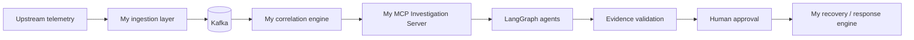

---

## 🗺️ Roadmap

- [ ] Replace the placeholder table above with real, linked contributions
- [ ] Add architecture decision records for choices made in this fork
- [ ] Publish a Grafana dashboard JSON for agent/tool failure rates
- [ ] Add a recorded demo (install → event → verdict → approval)
- [ ] Extend replay tests to cover the new recovery paths

---

## 🙏 Attribution & Upstream

SentinelMesh is a fork of **[AiSOC](https://github.com/beenuar/AiSOC)**, created by beenuar and the AiSOC
contributors and released under the **MIT License**. The original copyright and license notice are
preserved in [`LICENSE`](LICENSE). Architecture, detection library, connectors and the baseline pipeline
described in this README originate upstream; credit for them belongs to the AiSOC project.

## 📄 License

Released under the [MIT License](LICENSE).

<div align="center">


</div>
